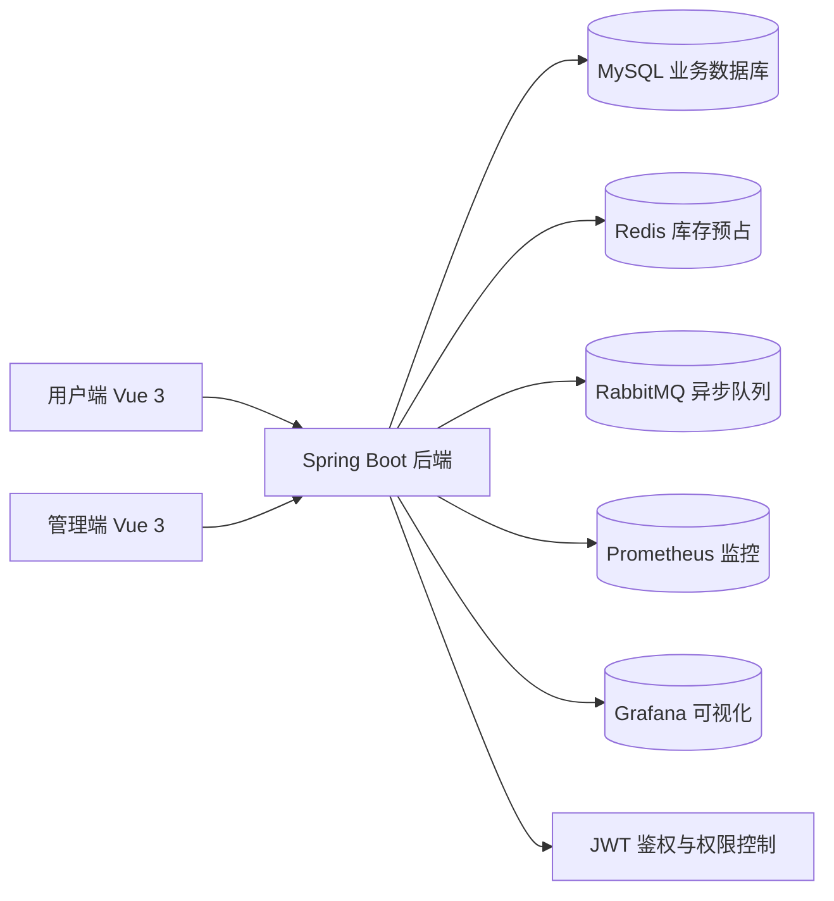
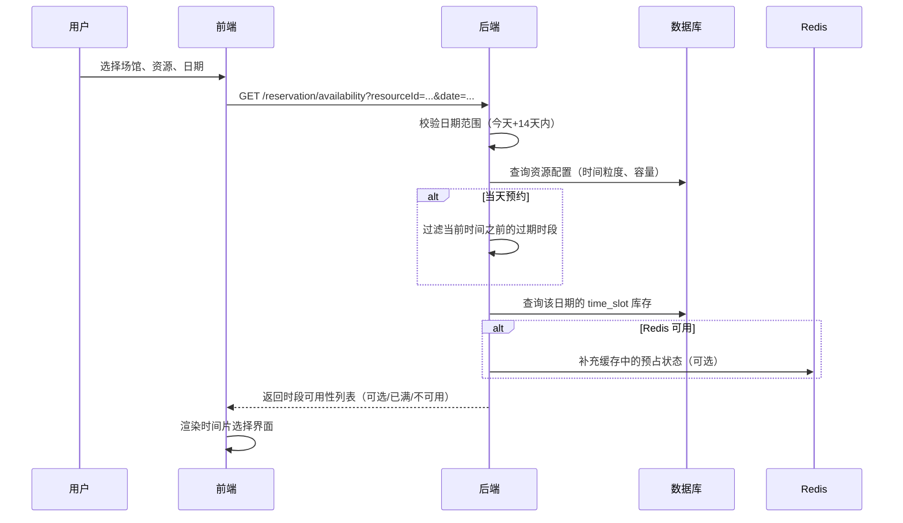
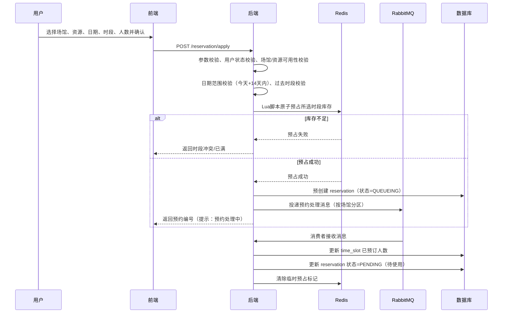
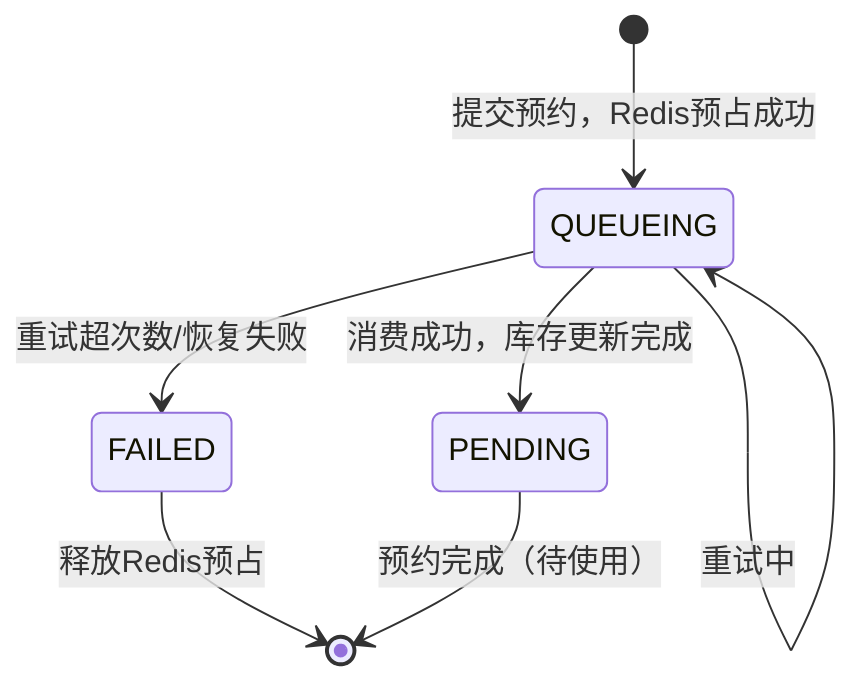
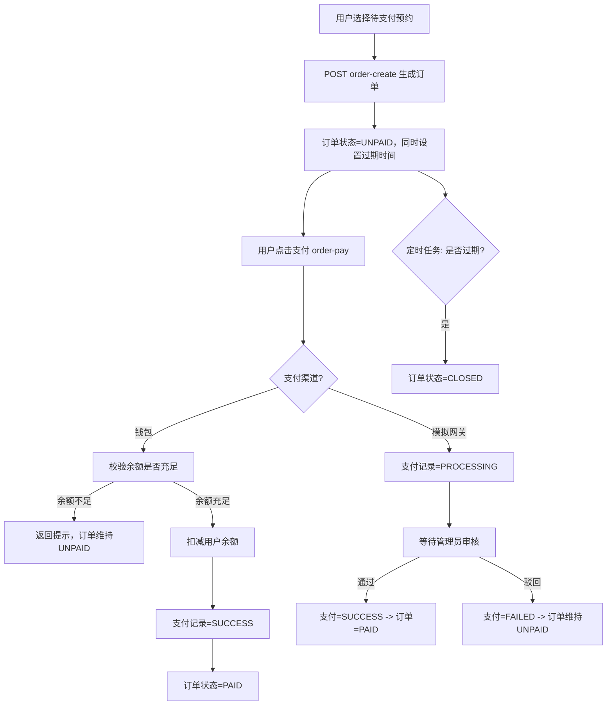
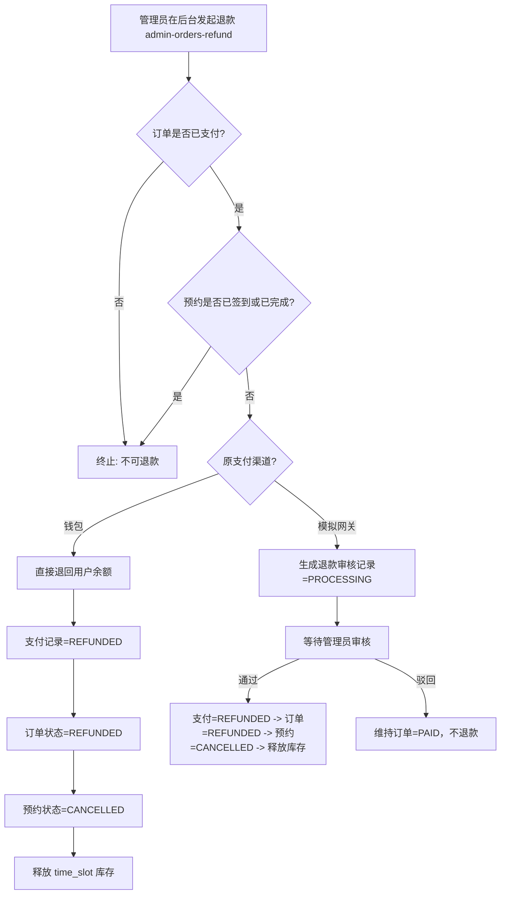
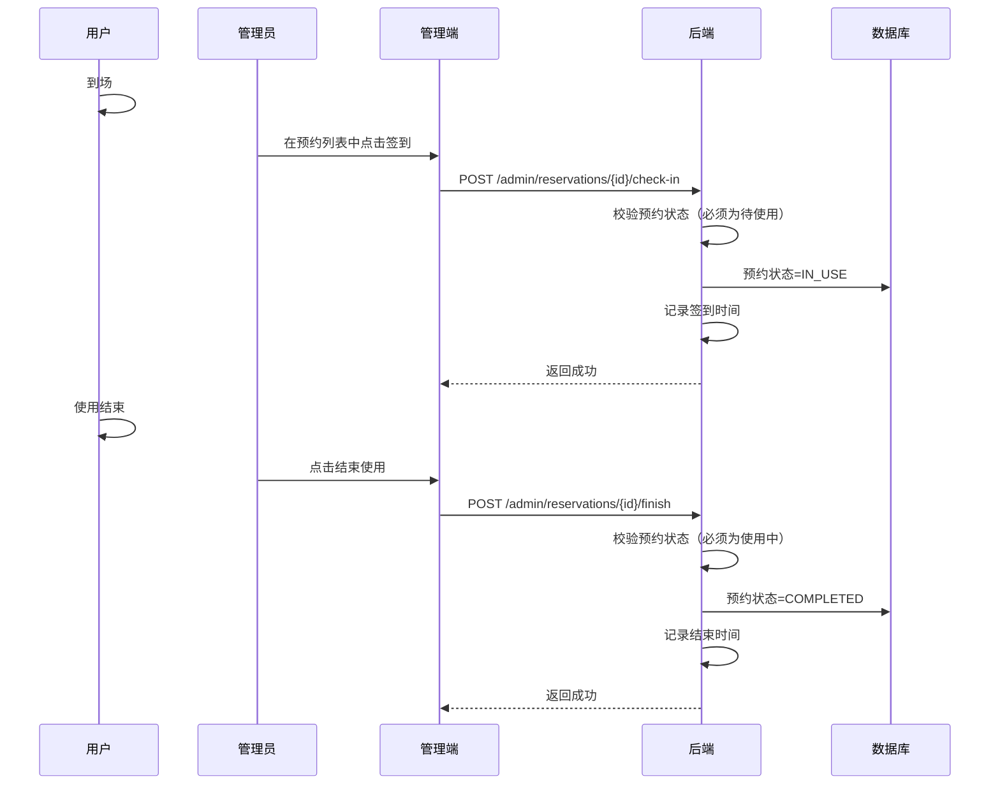

# CourtFlow 智慧场馆预约系统项目文档

---

## 项目信息

| 项目名称 | CourtFlow 智慧场馆预约系统 |
| :--- | :--- |
| 项目类型 | 前后端分离 + 管理后台 + 中间件支撑的场馆预约系统 |
| 前端技术 | Vue 3、Vite、Pinia、ECharts、lucide-vue-next |
| 后端技术 | Spring Boot 3、MyBatis-Plus、JWT |
| 数据与中间件 | MySQL、Redis、RabbitMQ、Prometheus、Grafana |
| 构建部署 | Maven Wrapper、Node.js、Docker、Docker Compose、GitHub Actions |
| 项目目标 | 实现场馆浏览、智能推荐、在线预约、订单支付、后台履约、权限隔离与基础性能验证 |

---

## 摘要

CourtFlow 智慧场馆预约系统面向校园、社区或综合体育中心等场景，围绕“场馆资源展示、在线预约下单、支付与退款处理、后台履约管理、角色权限控制”构建了一套完整的预约业务闭环。系统由 Spring Boot 后端、Vue 3 用户端与 Vue 3 管理端组成，支持普通用户、超级管理员和场地管理员三类角色，并针对预约并发、订单状态流转、支付审核、权限边界等核心问题进行了实现与优化。

在用户端，系统提供了场馆浏览、场地筛选、日期与时段选择、预约创建、我的预约查看与取消、个人资料修改、密码修改等功能；同时增加了基于资源属性与用户偏好的智能推荐能力，提升了预约入口的便捷性。在管理端，超级管理员可完成运营总览、场馆管理、资源管理、预约管理、订单管理、支付记录审核、用户信息管理等操作；场地管理员则被限制在所属场馆范围内，仅能处理预约管理与资源管理相关业务，从而体现多角色后台隔离设计。

在系统实现层面，本项目针对预约并发场景设计了“Redis 库存预占 + RabbitMQ 异步处理 + 重试恢复机制”的正式部署方案。系统通过 Redis Lua 脚本进行时段库存预占，再借助 RabbitMQ 分区队列完成预约落库与状态推进，从而降低高并发条件下超卖和竞态问题的风险。同时，系统还提供订单超时关闭、支付审核、退款处理、履约签到与完结等完整状态流转逻辑，保证业务数据的一致性。

此外，项目已配套 Bruno 接口集合、系统测试脚本、轻量负载测试脚本以及 JMeter 压测脚本与报告生成工具，便于开展功能验证和性能展示。整体来看，CourtFlow 已具备一个完整课程项目所需的系统架构、业务流程、权限设计、部署方式与测试材料，可作为智慧场馆预约方向的综合实践项目成果。

**关键词：** 智慧场馆预约、Spring Boot、Vue 3、Redis、RabbitMQ、JWT、订单支付、管理后台、性能测试

---

## 1. 项目背景与研究意义

随着校园体育活动、社区运动和全民健身需求的不断增长，场馆预约逐渐成为数字化服务中的高频业务。传统的线下登记、电话预约或表格统计方式存在如下问题：

- 信息分散，场馆、资源、时段状态不透明；
- 预约流程依赖人工，效率低、出错率高；
- 高峰时段容易发生重复登记、超额预约或信息冲突；
- 缺少角色化后台，难以支持管理人员进行履约处理和运营统计；
- 缺少统一的数据沉淀，不利于后续分析与优化。

基于上述问题，本项目设计并实现了 CourtFlow 智慧场馆预约系统，目标是构建一套具备实际业务闭环的预约管理平台，使普通用户可以完成便捷预约，使管理端能够高效处理资源配置、预约履约、订单与支付管理，同时在系统层面对并发预约、权限隔离、支付审核等关键问题进行约束和优化。

本项目的研究意义主要体现在以下几个方面：

- 将传统场馆预约流程数字化、标准化，提升用户体验与管理效率；
- 通过角色权限划分体现多租户/多角色后台管理思想；
- 通过 Redis、RabbitMQ 等中间件提升系统在并发预约场景下的稳定性；
- 通过订单、支付、退款、履约等链路展示完整业务状态机设计；
- 通过系统测试与压测材料支撑项目可用性与可展示性。

---

## 2. 项目目标

本项目围绕“用户预约闭环”和“后台运营闭环”设定如下建设目标：

1. 实现用户注册、登录、信息维护等基础账号能力；
2. 实现场馆展示、资源筛选、日期与时段选择、在线预约等核心业务能力；
3. 实现订单创建、支付、支付审核、退款与订单关闭等交易能力；
4. 实现预约履约流程，包括待使用、到场签到、使用中、已完成等状态管理；
5. 实现超级管理员与场地管理员两类后台权限隔离；
6. 实现远端正式环境下的稳定运行与中间件协同处理；
7. 提供系统测试、接口测试和性能测试材料，支持项目答辩与展示。

---

## 3. 需求分析

### 3.1 角色分析

系统设计了三类核心角色：

| 角色 | 说明 | 核心权限 |
| :--- | :--- | :--- |
| `USER` | 普通用户 | 注册、登录、浏览场馆、预约、查看与取消预约、维护个人资料 |
| `ADMIN` | 超级管理员 | 运营总览、场馆管理、资源管理、预约管理、订单管理、支付审核、用户管理 |
| `VENUE_ADMIN` | 场地管理员 | 仅管理绑定场馆范围内的预约与资源，无法操作总览、用户、支付、订单全局数据 |

### 3.2 功能需求

#### 3.2.1 用户端需求

- 支持用户注册与登录；
- 支持展示场馆列表和可预约资源；
- 支持按场馆名称、类型筛选预约目标；
- 支持按日期查看资源时段可用性；
- 支持连续时间段预约；
- 支持查看个人预约记录；
- 支持取消未完成预约；
- 支持修改昵称和密码；
- 支持获取推荐场馆/资源结果。

#### 3.2.2 管理端需求

- 支持管理员登录后台；
- 支持展示运营总览数据；
- 支持新增、修改、删除场馆与资源；
- 支持按日期、状态、关键字筛选预约记录；
- 支持到场签到、结束使用、取消预约等履约操作；
- 支持查看订单和支付记录；
- 支持审核模拟网关支付与退款；
- 支持维护用户角色、状态和余额。

#### 3.2.3 非功能需求

- 具备较清晰的前后端结构；
- 支持远端服务器正式部署；
- 支持容器化部署；
- 支持基础压测与测试结果留档；
- 尽量降低高并发场景下的重复预约与超卖风险；
- 保证角色之间的数据访问边界。

---

## 4. 总体设计

### 4.1 系统总体架构

本项目采用前后端分离与多端入口结合的总体思路。前端包括用户端和管理端两个 Vue 页面入口，后端采用 Spring Boot 提供 RESTful API，并在远端服务器上与 MySQL、Redis、RabbitMQ、Prometheus、Grafana 等组件协同运行。



### 4.2 技术架构说明

#### 前端层

- 使用 Vue 3 构建响应式页面；
- 使用 Vite 作为开发与构建工具；
- 用户端和管理端采用多入口页面结构；
- 管理端使用 ECharts 展示图表数据；
- 前端构建后静态资源可直接同步到 Spring Boot 的 `static` 目录。

#### 后端层

- 基于 Spring Boot 3 构建 Web 服务；
- 采用 MyBatis-Plus 进行数据库访问；
- 使用 JWT 实现登录态校验与角色识别；
- 使用统一响应对象封装接口返回；
- 使用业务异常处理保证错误信息规范输出。

#### 数据与中间件层

- MySQL 用于正式环境业务数据存储；
- Redis 用于预约时段库存预占和重试状态维护；
- RabbitMQ 用于预约异步处理与分区队列消费；
- Prometheus 用于指标采集；
- Grafana 用于监控面板展示。

### 4.3 项目目录结构

```text
smart_venue_booking_system
├─ src/main/java/com/courtflow/homework     后端核心代码
├─ src/main/resources/static                构建后的前端静态资源
├─ frontend/src                             前端源码目录（包含用户端与管理端）
├─ frontend/src/admin                       Vue 管理端源码
├─ deploy/mysql/init                        MySQL 初始化脚本
├─ deploy/remote                            远端 Docker Compose 模板
├─ bruno/CourtFlow-Core-APIs                Bruno 接口测试集合
├─ scripts                                  部署、测试、压测辅助脚本
├─ test-artifacts                           测试结果与截图产物
├─ docker-compose.yml                       容器编排文件
└─ Dockerfile                               镜像构建文件
```

---

## 5. 开发环境与运行环境

### 5.1 开发环境

| 项目 | 版本或说明 |
| :--- | :--- |
| JDK | 21 及以上 |
| Maven | 使用仓库内 Maven Wrapper |
| Node.js | 18 及以上 |
| 前端构建工具 | Vite |
| 操作系统 | Windows 环境已完成开发与测试 |

### 5.2 运行环境

| 组件 | 说明 |
| :--- | :--- |
| 应用服务 | Spring Boot 单体应用 |
| 数据库 | MySQL 8.0 |
| 缓存 | Redis 7 |
| 消息队列 | RabbitMQ 4.0 |
| 监控组件 | Prometheus、Grafana |
| 部署方式 | Docker Compose 远端部署 |

---

## 6. 核心功能设计

### 6.1 用户端功能设计

用户端以移动端风格界面为主，围绕“浏览场馆 -> 选择资源 -> 查看时段 -> 提交预约 -> 查看我的预约”完成完整闭环。

#### 6.1.1 首页

- 展示欢迎文案和推荐场馆卡片；
- 展示开放场馆数、可约场地数、预约记录数等简要指标；
- 提供热门场馆入口，点击可快速进入预约页。


#### 6.1.2 预约页

- 支持按关键字搜索场馆；
- 支持按场馆类型筛选；
- 支持查看场馆下的资源列表；
- 支持选择具体日期与预约人数；
- 支持查看时间片可用性；
- 支持连续时间段选择与价格汇总；
- 自动限制预约日期必须在今天起 14 天内；
- 若预约当天，自动过滤当前时刻之前的过期时段。


#### 6.1.3 我的预约页

- 展示用户头像、昵称、角色、钱包余额；
- 展示待使用、总预约、已取消等统计；
- 支持按状态筛选预约记录；
- 支持取消待使用预约。


#### 6.1.4 账号设置页

- 支持修改昵称；

- 支持修改密码；

- 支持退出登录。

  

### 6.2 智能推荐功能设计

系统提供轻量化的推荐接口，根据以下因素综合计算资源评分：

- 运动关键字与资源类型匹配程度；
- 时间粒度是否符合用户偏好；
- 资源容量是否满足人数需求；
- 单价是否在预算范围内；
- 用户是否偏好低价资源；
- 用户是否偏好大容量资源；
- 用户期望预约时长。

推荐功能虽然不依赖大型模型，但已体现“基于画像与资源属性进行打分排序”的智能化思路，适合作为课程项目中的推荐模块展示。

### 6.3 管理端功能设计

管理端分为超级管理员与场地管理员两类视图。

#### 6.3.1 超级管理员功能

- 运营总览；

- 场馆管理；

- 资源管理；

- 预约管理；

- 订单管理；

- 支付记录管理；

- 用户信息管理。

  

#### 6.3.2 场地管理员功能

- 查看自己绑定的场馆范围；

- 仅管理所属场馆的预约记录；

- 仅管理所属场馆的资源；

- 可切换场馆状态；

- 不可访问运营总览、用户、订单、支付全局数据。

  

#### 6.3.3 后台运营总览

运营总览页面提供以下信息：

- 开放场馆数；
- 启用资源数；
- 预约总数；
- 订单总数；
- 待审核支付数；
- 注册用户数；
- 预约趋势图；
- 预约状态分布图；
- 场馆资源排行图；
- 最近预约记录列表。

#### 6.3.4 场馆与资源管理

- 支持新增、编辑、删除场馆；

- 支持新增、编辑、删除资源；

- 资源包含所属场馆、资源名称、类型、容量、单价、时间粒度和状态；

- 删除前会进行业务校验，若存在相关预约记录则禁止直接删除。

  

#### 6.3.5 预约履约管理

- 支持按状态、日期、关键字筛选预约；

- 支持取消预约；

- 支持对“待使用”预约执行到场签到；

- 支持对“使用中”预约执行结束使用；

- 对未支付订单、退款处理中订单进行履约限制。

  

#### 6.3.6 订单与支付管理

- 支持查看订单详情、订单状态和关联预约；

- 支持关闭未支付订单；

- 支持对已支付订单发起退款；

- 支持查看支付记录、支付渠道、支付状态；

- 支持对模拟网关支付与退款申请执行人工审核。

  

#### 6.3.7 用户管理

- 支持查看用户角色、状态、余额；

- 支持修改用户角色；

- 支持启用/禁用用户；

- 支持调整用户余额。

  

---

## 7. 核心业务流程设计

### 7.1 预约可用性查询流程

用户在预约前，需要先查看所选日期和资源的时段可用性。系统会自动过滤过期时段、不可约时段，并为前端返回格式化的时间片列表。



前端会根据可用性状态对时间片着色，同时根据 `unitMinutes` 自动计算每个时间片的开始/结束时刻，支持连续时段多选。

### 7.2 用户预约业务流程（库存预占+异步处理）



预约流程中的关键设计点如下：

- 预约创建前进行用户、场馆、资源、日期、时间段、人数等多维校验；
- 限制预约日期只能在今天到未来 14 天内；
- 对当天预约场景限制过去时段不可再预约；
- 支持连续时间片预约；
- 通过 Redis Lua 脚本实现多时段原子预占；
- 利用 RabbitMQ 异步消费与分区队列减少数据库直接写入冲突；
- 若消费失败，可触发重试或定时任务恢复。

### 7.3 预约排队与恢复状态机



系统通过 `ReservationQueueRecoveryJob` 定时扫描长时间处于 `QUEUEING` 的预约，并尝试重新推进状态或回滚。

### 7.4 订单支付流程

预约成功后，用户可基于预约记录创建订单。系统会根据预约的时间片数量和资源单价计算总金额，并生成订单与支付记录。



支付支持两种渠道：

- **钱包余额支付**：若用户余额充足，则直接扣款成功并将订单状态改为已支付；
- **模拟网关支付**：系统先生成待审核支付记录，再由管理员在后台审核通过或驳回。

### 7.5 退款流程（含审核）



退款核心约束：

- 仅已支付订单支持退款；
- 若预约已签到或已完成，则禁止退款；
- 钱包支付的退款可直接回退到用户余额；
- 模拟网关支付的退款需进入管理员审核流程；
- 退款成功后，订单状态变更为已退款，对应预约自动取消。

### 7.6 履约流程（签到/完结）

后台履约流程如下：



履约状态流转说明：

1. 用户预约并完成支付后，预约状态为“待使用（PENDING）”；
2. 用户到场后，管理员点击“到场签到”；
3. 系统将预约状态变更为“使用中（IN_USE）”；
4. 使用结束后，管理员点击“结束使用”；
5. 系统将预约状态变更为“已完成（COMPLETED）”。

### 7.7 流程与实现文件对照

| 流程 | 主要实现文件 |
| :--- | :--- |
| 预约可用性查询与格式化 | 后端 [ReservationController.java](file:///c:/Users/GALAXY/Desktop/新建文件夹/main/smart_venue_booking_system/src/main/java/com/courtflow/homework/controller/ReservationController.java) / 前端 [DemoApp.vue](file:///c:/Users/GALAXY/Desktop/新建文件夹/main/smart_venue_booking_system/frontend/src/demo/DemoApp.vue) |
| 预约申请与 Redis 库存预占 | [ReservationServiceImpl.java](file:///c:/Users/GALAXY/Desktop/新建文件夹/main/smart_venue_booking_system/src/main/java/com/courtflow/homework/service/Impl/ReservationServiceImpl.java) |
| 异步消费与重试恢复 | [ReservationHandler.java](file:///c:/Users/GALAXY/Desktop/新建文件夹/main/smart_venue_booking_system/src/main/java/com/courtflow/homework/handler/ReservationHandler.java)、[ReservationQueueRecoveryJob.java](file:///c:/Users/GALAXY/Desktop/新建文件夹/main/smart_venue_booking_system/src/main/java/com/courtflow/homework/handler/ReservationQueueRecoveryJob.java) |
| 订单创建、支付、退款、超时关闭 | [OrderWorkflowServiceImpl.java](file:///c:/Users/GALAXY/Desktop/新建文件夹/main/smart_venue_booking_system/src/main/java/com/courtflow/homework/service/Impl/OrderWorkflowServiceImpl.java)、[OrderController.java](file:///c:/Users/GALAXY/Desktop/新建文件夹/main/smart_venue_booking_system/src/main/java/com/courtflow/homework/controller/OrderController.java) |
| 履约签到/完结/取消 | [AdminController.java](file:///c:/Users/GALAXY/Desktop/新建文件夹/main/smart_venue_booking_system/src/main/java/com/courtflow/homework/controller/AdminController.java) |
| 队列与监听配置 | [RabbitConfig.java](file:///c:/Users/GALAXY/Desktop/新建文件夹/main/smart_venue_booking_system/src/main/java/com/courtflow/homework/common/config/RabbitConfig.java) |

---

## 8. 权限设计

### 8.1 登录与鉴权

- 用户登录成功后，后端生成 JWT；
- 前端将 token 保存到本地存储；
- 后续请求通过请求头携带 `Authorization: Bearer <token>`；
- 后端拦截器解析 token，并将用户信息写入上下文；
- 控制层根据角色判断接口访问权限。

### 8.2 权限边界控制

系统在权限方面重点控制以下边界：

- 普通用户只能查看和操作自己的预约、订单及个人信息；
- 超级管理员可以访问后台全部模块；
- 场地管理员只能访问自己绑定场馆范围内的资源与预约；
- 用户不可越权查看其他用户预约详情；
- 预约管理、支付审核、退款处理等敏感操作均需管理员权限。

### 8.3 权限设计意义

该设计体现了完整的 RBAC 基础思想，同时结合了场馆维度的数据范围隔离，是本项目在后台管理设计中的重要亮点之一。

---

## 9. 数据库设计

### 9.1 数据库选型

- 运行环境数据库：MySQL；
- 线上部署方式：Docker Compose；
- 数据初始化方式：通过远端脚本执行建表与基线数据导入；
- 建表脚本：`deploy/mysql/init/01_schema.sql`；
- 基线数据脚本：`deploy/mysql/init/02_seed.sql`。

### 9.2 数据设计目标

本系统的数据设计围绕“账号认证、场馆资源组织、预约下单、支付退款、管理员授权”五条主线展开，重点满足以下要求：

- 支持普通用户、超级管理员、场地管理员三类角色；
- 支持场馆与资源的层级组织结构；
- 支持基于日期和时间片的预约库存管理；
- 支持预约、订单、支付三类业务对象解耦；
- 支持场地管理员与场馆之间的多对多授权关系；
- 支持后续扩展 Redis 预占、MQ 异步处理和统计分析。

### 9.3 概念结构设计

从业务视角看，系统中的核心实体包括：用户、认证信息、场馆、场馆资源、预约、时间片、订单、支付记录、场地管理员绑定关系。

```text
用户(User)
  ├─ 认证信息(UserAuth)
  ├─ 预约(Reservation)
  └─ 订单(Order)

场馆(Venue)
  ├─ 资源(VenueResource)
  └─ 场地管理员绑定(VenueAdmin)

资源(VenueResource)
  ├─ 时间片(TimeSlot)
  └─ 预约(Reservation)

订单(Order)
  └─ 支付记录(Payment)
```

各实体之间的核心业务语义如下：

- 一个用户可以拥有多条预约记录和多张订单；
- 一个用户对应一组认证信息，用于用户名密码登录；
- 一个场馆下可以包含多个可预约资源；
- 一个资源在不同日期下可拆分为多个时间片；
- 一条预约只对应一个用户和一个资源，但可关联一个订单；
- 一张订单可以拥有多条支付记录，用于表示支付与退款流水；
- 一个场地管理员可以管理多个场馆，一个场馆也可以授权给多个管理员。

### 9.4 逻辑结构设计

根据概念模型，系统最终抽象出 9 张核心业务表：

| 数据表 | 作用说明 | 关键关系 |
| :--- | :--- | :--- |
| `user` | 用户基础信息表，存储用户名、昵称、角色、余额、状态等 | 与 `reservation`、`order` 一对多 |
| `user_auth` | 用户认证表，存储登录标识与加密密码 | 与 `user` 一对一/一对多 |
| `venue` | 场馆表，存储场馆名称、类型、状态 | 与 `venue_resource` 一对多 |
| `venue_resource` | 资源表，存储具体场地、资源类型、容量、价格、时间粒度 | 与 `time_slot`、`reservation` 一对多 |
| `reservation` | 预约表，存储用户预约记录、时段、状态、关联订单等 | 与 `user`、`venue`、`venue_resource` 多对一 |
| `time_slot` | 时间片库存表，记录资源在某一天某一时段的占用情况 | 与 `venue_resource` 多对一 |
| `order` | 订单表，存储订单编号、金额、状态、过期时间等 | 与 `user` 多对一 |
| `payment` | 支付记录表，存储支付/退款流水、渠道、审核状态等 | 与 `order` 多对一 |
| `venue_admin` | 场地管理员绑定表，记录管理员与场馆的对应关系 | 连接 `user` 与 `venue` |

### 9.5 核心表设计说明

本节从用户认证、场馆资源、预约库存、订单支付和权限授权五个维度，对数据库核心表结构进行说明。

### 9.6 核心表结构设计

#### 9.6.1 用户与认证

**用户表 `user`**

- `id`：主键，自增；
- `username`：用户账号，唯一；
- `nickname` / `full_name`：昵称与展示名称；
- `status`：用户状态，用于控制是否可登录、是否可参与业务；
- `balance`：钱包余额，单位为分；
- `role`：角色标识，区分 `USER`、`ADMIN`、`VENUE_ADMIN`；
- `created_at`：创建时间。

**认证表 `user_auth`**

- `user_id`：关联用户主键；
- `identity_type`：认证类型，当前主要为 `username`；
- `identifier`：认证标识，如用户名；
- `credential`：加密密码；
- `last_login_at`：最近登录时间；
- `updated_at`：密码或认证信息变更时间。

拆分 `user` 与 `user_auth` 的目的是将“业务资料”和“认证凭证”分离，便于未来扩展手机号、邮箱等多种登录方式。

#### 9.6.2 场馆与资源

**场馆表 `venue`**

- `name`：场馆名称；
- `type`：场馆类型或运动类别组合描述；
- `status`：场馆启用状态；
- `created_at`：创建时间。

**资源表 `venue_resource`**

- `venue_id`：所属场馆；
- `name`：具体资源名称，如某号羽毛球场、某泳道；
- `resource_type`：资源类型枚举；
- `capacity`：可容纳人数；
- `price`：单时间片价格，单位为分；
- `unit_minutes`：时间粒度，如 10 分钟、20 分钟、30 分钟；
- `status`：资源状态。

该设计实现了“场馆”与“资源”的分层建模，既能展示场馆总体信息，也能精确到具体可预约单元。

#### 9.6.3 预约与时间片

**预约表 `reservation`**

- `user_id`：预约用户；
- `venue_id`：所属场馆；
- `resource_id`：预约资源；
- `order_id`：关联订单；
- `slot_date`：预约日期；
- `start_unit` / `end_unit`：预约的起止时间片编号；
- `size`：预约人数；
- `status`：预约状态；
- `created_at` / `updated_at`：创建与更新时间。

**时间片表 `time_slot`**

- `resource_id`：所属资源；
- `slot_date`：日期；
- `slot_unit`：时间片编号；
- `status`：时间片状态；
- `booked_count`：当前已占用人数；
- `updated_at`：最近更新时间。

其中，`time_slot` 使用 `(resource_id, slot_date, slot_unit)` 作为唯一约束，用于保证同一资源在同一天同一时间片只会出现一条库存记录，是预约并发控制的重要基础。

#### 9.6.4 订单与支付

**订单表 `order`**

- `order_no`：订单编号，唯一；
- `user_id`：下单用户；
- `total_amount`：订单总金额，单位为分；
- `status`：订单状态；
- `expired_at`：过期时间；
- `created_at` / `updated_at`：创建与更新时间。

**支付表 `payment`**

- `order_id`：关联订单；
- `payment_no`：支付流水号，唯一；
- `biz_type`：业务类型，区分支付和退款；
- `pay_channel`：支付渠道，如钱包、模拟网关；
- `channel_trade_no`：外部渠道流水号；
- `pay_amount`：支付或退款金额；
- `pay_status`：支付状态；
- `status_note`：状态说明或审核备注；
- `paid_at` / `processed_at`：支付成功时间与处理完成时间。

订单与支付分表设计可以避免订单主表承载过多流水细节，同时也方便支持多次支付尝试、退款记录与审核流程。

#### 9.6.5 场地管理员绑定

**绑定表 `venue_admin`**

- `user_id`：管理员用户 ID；
- `venue_id`：被授权管理的场馆 ID。

该表采用 `(user_id, venue_id)` 唯一约束，确保同一管理员不会被重复绑定到同一场馆。通过该表，系统实现了场地管理员仅能查看和操作自己授权场馆数据的权限边界。

### 9.7 字段编码与状态设计

系统大量使用枚举值来降低字符串比较成本，并保持数据库字段紧凑性。典型设计包括：

| 业务对象 | 字段 | 含义 |
| :--- | :--- | :--- |
| 用户 | `role` | `USER`、`ADMIN`、`VENUE_ADMIN` |
| 用户 | `status` | 启用、禁用等状态 |
| 场馆/资源 | `status` | 启用、停用等状态 |
| 预约 | `status` | 排队中、待使用、使用中、已完成、已取消等 |
| 订单 | `status` | 未支付、已支付、已关闭、已退款 |
| 支付 | `biz_type` | 支付、退款 |
| 支付 | `pay_status` | 处理中、成功、失败 |
| 时间片 | `status` | 可预约、不可用、已满等 |

这些状态值在代码中分别由 `ReservationStatusEnum`、`OrderStatusEnum`、`PaymentStatusEnum`、`PaymentBizTypeEnum`、`TimeSlotStatusEnum` 等枚举统一维护，保证了业务状态流转的一致性。

### 9.8 索引与约束设计

为了支撑查询效率和业务正确性，数据库设计中加入了以下关键索引与约束：

- `user.username` 唯一索引，防止账号重复；
- `user_auth(identity_type, identifier)` 唯一索引，保证认证标识唯一；
- `time_slot(resource_id, slot_date, slot_unit)` 唯一索引，保证时间片唯一；
- `order.order_no` 唯一索引，保证订单编号唯一；
- `payment.payment_no`、`payment.channel_trade_no` 唯一索引，保证流水号唯一；
- `venue_admin(user_id, venue_id)` 唯一索引，防止重复授权；
- `reservation.user_id`、`reservation.resource_id`、`reservation.status` 等普通索引，用于支撑高频列表查询与筛选；
- `payment(order_id, biz_type)` 组合索引，用于订单支付/退款记录查询。

这些索引既服务于接口查询性能，也为预约、支付、权限控制等核心业务提供了底层约束保障。

### 9.9 基线数据设计

除了表结构，本项目还设计了可重复执行的基线数据脚本，用于初始化演示与答辩环境。基线数据主要包括：

- 普通用户、超级管理员、场地管理员账号；
- 多个场馆与资源样例；
- 若干历史预约、未来预约和已完成预约；
- 对应的订单与支付流水；
- 时间片库存数据；
- 场地管理员与场馆的绑定关系。

以当前基线数据为例：

- 用户包括 `caojinshuo`、`zhangxiang`、`admin` 等账号；
- 场馆包括主体育馆、中央篮球馆、东区网球中心、南区羽毛球馆等；
- 资源包含羽毛球场、篮球场、网球场、泳道等多种类型；
- 基线数据中已经体现“待使用”“已完成”等不同预约状态，便于前后端联调和答辩展示。

这种“建表脚本 + 种子数据脚本”的方式使项目在远端部署、联调测试、功能演示时具备较好的可复现性。

---

## 10. 接口设计

### 10.1 接口风格

- 采用 RESTful 风格；
- 返回统一 `ApiResponse` 结构；
- 成功时返回 `code=200`；
- 失败时返回对应错误码和提示信息；
- 需要登录的接口使用 JWT 做身份校验。

### 10.2 核心接口一览

#### 认证接口

| 方法 | 路径 | 说明 |
| :--- | :--- | :--- |
| POST | `/auth/register` | 用户注册 |
| POST | `/auth/login` | 用户登录 |

#### 用户端接口

| 方法 | 路径 | 说明 |
| :--- | :--- | :--- |
| GET | `/venue/list` | 获取场馆与资源列表 |
| POST | `/recommendation/venues` | 获取推荐结果 |
| POST | `/reservation/apply` | 提交预约 |
| GET | `/reservation/my` | 获取我的预约分页列表 |
| GET | `/reservation/{id}` | 获取预约详情 |
| GET | `/reservation/availability` | 查询可预约时段 |
| POST | `/reservation/{id}/cancel` | 取消预约 |
| GET | `/user/profile` | 获取个人信息 |
| PUT | `/user/profile` | 修改昵称 |
| PUT | `/user/password` | 修改密码 |
| GET | `/order/my` | 获取我的订单 |
| GET | `/order/{id}` | 获取订单详情 |
| POST | `/order/create` | 基于预约创建订单 |
| POST | `/order/{id}/pay` | 支付订单 |

#### 管理端接口

| 方法 | 路径 | 说明 |
| :--- | :--- | :--- |
| GET | `/admin/profile` | 获取管理员信息与管理范围 |
| GET | `/admin/dashboard` | 获取运营总览 |
| GET | `/admin/venues` | 获取后台场馆列表 |
| POST | `/admin/venues` | 新增场馆 |
| PUT | `/admin/venues/{id}` | 修改场馆 |
| POST | `/admin/venues/{id}/status` | 更新场馆状态 |
| DELETE | `/admin/venues/{id}` | 删除场馆 |
| GET | `/admin/resources` | 获取资源列表 |
| POST | `/admin/resources` | 新增资源 |
| PUT | `/admin/resources/{id}` | 修改资源 |
| DELETE | `/admin/resources/{id}` | 删除资源 |
| GET | `/admin/reservations` | 获取预约列表 |
| POST | `/admin/reservations/{id}/cancel` | 后台取消预约 |
| POST | `/admin/reservations/{id}/check-in` | 到场签到 |
| POST | `/admin/reservations/{id}/finish` | 结束使用 |
| GET | `/admin/orders` | 获取订单列表 |
| POST | `/admin/orders/{id}/close` | 关闭订单 |
| POST | `/admin/orders/{id}/refund` | 订单退款 |
| GET | `/admin/payments` | 获取支付记录 |
| POST | `/admin/payments/{id}/approve` | 通过支付/退款审核 |
| POST | `/admin/payments/{id}/reject` | 驳回支付/退款审核 |
| GET | `/admin/users` | 获取用户列表 |
| PUT | `/admin/users/{id}` | 修改用户信息 |

### 10.3 后端接口测试截图预留

**截图预留：Bruno / Postman 接口测试截图**

> 此处插入后端接口测试截图  
> 接口集合目录：`bruno/CourtFlow-Core-APIs`

---

## 11. 关键实现与技术亮点

### 11.1 正式环境预约实现

本项目当前采用远端正式部署方案，启用 Redis + RabbitMQ，通过库存预占、异步消费、失败重试与恢复任务协同完成预约处理，在高并发预约场景下提升系统稳定性与数据一致性。

### 11.2 Redis Lua 预约库存预占

在正式模式下，预约提交时会先使用 Redis Lua 脚本对所选时间片进行原子化库存预占，避免多个请求同时抢占同一时段时发生库存穿透和竞争冲突。若库存不足，则直接返回冲突结果。

### 11.3 RabbitMQ 分区队列异步处理

Redis 预占成功后，系统将预约请求投递到 RabbitMQ 队列，由消费者异步落库和更新时段占用。这一设计将高并发下的库存争抢与数据库写操作解耦，减少直接写库冲突。

### 11.4 重试与恢复机制

若队列消费时发生时段更新冲突，系统会：

- 记录重试次数；
- 将消息重新入队；
- 超过重试上限则将预约置为过期并释放库存；
- 定时任务会扫描长时间处于排队状态的预约并尝试恢复。

### 11.5 订单状态机设计

订单状态包括：

- 未支付；
- 已支付；
- 已关闭；
- 已退款。

同时系统配套支付状态与预约状态，确保以下问题得到约束：

- 超时未支付订单自动关闭；
- 已失效预约对应订单不能继续支付；
- 已签到或已完成预约禁止退款；
- 退款成功后自动取消预约。

### 11.6 管理端角色范围隔离

系统不仅区分“是否管理员”，还区分“超级管理员”和“场地管理员”，并将场地管理员限制到所绑定场馆范围内，体现了较完整的数据范围权限设计。

### 11.7 推荐模块可视化展示价值

推荐接口虽然采用规则与评分机制实现，但能够在答辩中展示“个性化推荐”的产品思路，同时前端首页也已对推荐结果进行卡片式展示，使系统更具完整性和智能化特色。

### 11.8 Prometheus + Grafana 监控

本项目在远端部署中集成了 Prometheus 指标采集与 Grafana 可视化面板，能够展示：

- JVM 指标（堆内存、GC、线程数）；
- HTTP 请求 QPS、响应时间分布；
- 自定义业务指标（预约提交数、支付数、退款数等）；
- 中间件连接状态。

配置文件位置：

- Prometheus 采集规则：项目内可配套提供或通过远端配置；
- Grafana 面板：可导入 Spring Boot 通用监控面板。

监控访问地址：

- Prometheus：`http://150.158.132.178:9090`

- Grafana：`http://150.158.132.178:3000`

  

  

### 11.9 完整的初始化与测试工具链

项目已配套一系列脚本与工具，便于部署、测试与演示：

| 工具/脚本 | 位置 | 说明 |
| :--- | :--- | :--- |
| Bruno 接口集合 | `bruno/CourtFlow-Core-APIs` | 完整的用户端与管理端接口调试集合 |
| 系统测试脚本 | `scripts/run-system-test.ps1` | 自动化核心业务验证并生成截图与报告 |
| 轻量负载测试 | `scripts/run-load-test.ps1` | 对高频接口进行并发测试与汇总 |
| JMeter 压测脚本 | `scripts/run-jmeter-reservation-test.ps1` | 预约接口专属压测与 HTML Dashboard 生成 |
| 远端初始化脚本 | `scripts/bootstrap-remote-prod.ps1` | 上传建表脚本、基线数据并在远端 MySQL 执行 |
| MySQL 建表脚本 | `deploy/mysql/init/schema.sql` | 完整表结构定义 |
| MySQL 基线数据 | `deploy/mysql/init/baseline-data.sql` | 预置场馆、资源、用户、场地管理员映射 |

### 11.10 流程与源码参考

- 预约申请与库存预占实现：[ReservationServiceImpl.java](file:///c:/Users/GALAXY/Desktop/新建文件夹/main/smart_venue_booking_system/src/main/java/com/courtflow/homework/service/Impl/ReservationServiceImpl.java)
- 预约异步消费与重试恢复：[ReservationHandler.java](file:///c:/Users/GALAXY/Desktop/新建文件夹/main/smart_venue_booking_system/src/main/java/com/courtflow/homework/handler/ReservationHandler.java)、[ReservationQueueRecoveryJob.java](file:///c:/Users/GALAXY/Desktop/新建文件夹/main/smart_venue_booking_system/src/main/java/com/courtflow/homework/handler/ReservationQueueRecoveryJob.java)
- 消息队列与监听容器配置：[RabbitConfig.java](file:///c:/Users/GALAXY/Desktop/新建文件夹/main/smart_venue_booking_system/src/main/java/com/courtflow/homework/common/config/RabbitConfig.java)
- 订单与支付全流程（支付受理、审核、退款、超时关闭）：[OrderWorkflowServiceImpl.java](file:///c:/Users/GALAXY/Desktop/新建文件夹/main/smart_venue_booking_system/src/main/java/com/courtflow/homework/service/Impl/OrderWorkflowServiceImpl.java)、[OrderController.java](file:///c:/Users/GALAXY/Desktop/新建文件夹/main/smart_venue_booking_system/src/main/java/com/courtflow/homework/controller/OrderController.java)
- 管理端履约（签到/完结）与权限边界：[AdminController.java](file:///c:/Users/GALAXY/Desktop/新建文件夹/main/smart_venue_booking_system/src/main/java/com/courtflow/homework/controller/AdminController.java)
- 可用时段计算与格式化展示：前端用户端 [DemoApp.vue](file:///c:/Users/GALAXY/Desktop/新建文件夹/main/smart_venue_booking_system/frontend/src/demo/DemoApp.vue)

---

## 12. 远端部署与运行说明

### 12.1 当前远端部署概况

本项目已部署到远端服务器，当前采用 Docker Compose 方式运行完整正式环境。

#### 服务器与部署信息

| 项目 | 内容 |
| :--- | :--- |
| 服务器地址 | `150.158.132.178` |
| SSH 用户 | `ubuntu` |
| 远端部署目录 | `/home/ubuntu/courtflow` |
| 应用容器 | `courtflow` |
| 数据库容器 | `mysql` |
| Redis 容器 | `redis` |
| RabbitMQ 容器 | `rabbitmq` |
| Prometheus 容器 | `prometheus` |
| Grafana 容器 | `grafana` |

#### 前端构建命令

```powershell
cd .\frontend
npm install
npm run build:backend
```

构建后的前端资源会同步到 Spring Boot 的 `src/main/resources/static` 目录，并由远端运行中的应用统一提供访问。

### 12.2 远端访问地址

#### 对外访问入口

- 应用首页：`http://150.158.132.178:8080/`
- 用户端：`http://150.158.132.178:8080/demo/index.html`
- 管理端：`http://150.158.132.178:8080/admin/index.html`
- RabbitMQ 管理台：`http://150.158.132.178:15672`
- Prometheus：`http://150.158.132.178:9090`
- Grafana：`http://150.158.132.178:3000`

### 12.3 远端 Docker Compose 组成

远端 `compose` 模板位于 `deploy/remote/docker-compose.remote.yml`，当前部署包含以下服务：

- MySQL；
- Redis；
- RabbitMQ；
- Prometheus；
- Grafana；
- Spring Boot 应用。

其中主要端口映射如下：

- 应用服务：`8080:8080`
- MySQL：`3306:3306`
- Redis：`6379:6379`
- RabbitMQ：`5672:5672`
- RabbitMQ 控制台：`15672:15672`
- Prometheus：`9090:9090`
- Grafana：`3000:3000`

### 12.4 远端初始化与更新

项目已提供远端初始化脚本 `scripts/bootstrap-remote-prod.ps1`，可用于：

- 上传建表脚本；
- 上传基线数据脚本；
- 在远端 MySQL 容器内执行建表与数据初始化；
- 按需重启应用容器；
- 自动执行健康检查。

#### 推荐执行命令

```powershell
.\scripts\bootstrap-remote-prod.ps1 `
  -ServerHost 150.158.132.178 `
  -ServerUser ubuntu `
  -RemoteDir /home/ubuntu/courtflow `
  -DbContainer mysql `
  -DbName courtflow `
  -DbUser admin `
  -DbPassword admin123 `
  -AppContainer courtflow `
  -RestartApp
```

### 12.5 远端运维常用命令

#### SSH 登录服务器

```powershell
ssh ubuntu@150.158.132.178
```

#### 查看远端容器状态

```bash
sudo docker ps
```

#### 查看应用健康状态

```bash
curl http://127.0.0.1:8080/actuator/health
```

#### 重启应用容器

```bash
sudo docker restart courtflow
```

### 12.6 持续集成说明

项目已配置 GitHub Actions 工作流，在代码推送到 `main` 分支后可以自动：

1. 检出仓库；
2. 构建 Docker 镜像；
3. 推送镜像到 Docker Hub。

这说明项目已经具备基础 CI/CD 能力。

### 12.7 部署截图预留

**截图预留：Docker 容器运行状态**

> 此处插入 Docker 容器运行截图

**截图预留：RabbitMQ / Redis / MySQL 运行截图**

> 此处插入后端运行环境截图

---

## 13. 测试设计与结果分析

### 13.1 测试目标

测试工作主要围绕以下几个方面展开：

- 验证核心 API 是否可正常访问；
- 验证用户预约业务链路是否闭环；
- 验证前后端页面是否能正常展示；
- 验证系统在一定并发下的响应情况；
- 验证预约接口压测的成功率与时延指标。

### 13.2 接口与系统测试

项目已生成系统测试摘要，测试内容包括：

- 登录接口；
- 场馆列表接口；
- 推荐接口；
- 用户信息接口；
- 预约列表查询；
- 提交预约；
- 预约详情查询；
- 取消预约；
- 取消后的预约列表验证。

根据现有系统测试结果，核心 API 测试用例全部通过。

#### 系统测试结果摘要

| 用例编号 | 用例名称 | 结果 | 响应时间(ms) |
| :--- | :--- | :---: | ---: |
| T01 | Login API | PASS | 493.81 |
| T02 | Venue list API | PASS | 199.84 |
| T03 | Recommendation API | PASS | 123.43 |
| T04 | Profile API | PASS | 290.98 |
| T05 | Reservation list before apply | PASS | 68.20 |
| T06 | Apply reservation | PASS | 225.91 |
| T07 | Reservation detail | PASS | 54.68 |
| T08 | Cancel reservation | PASS | 173.81 |
| T09 | Reservation list after cancel | PASS | 59.33 |

### 13.3 轻量负载测试结果

项目还对若干高频接口进行了轻量并发测试，测试配置如下：

- 并发数：20；
- 每个 worker 执行轮次：10；
- 每个接口请求总数：200。

测试结果如下：

| 接口 | 成功率 | 平均(ms) | P95(ms) | P99(ms) | 最大(ms) | 吞吐(req/s) |
| :--- | ---: | ---: | ---: | ---: | ---: | ---: |
| Login API | 100.0% | 122.01 | 148.77 | 156.72 | 165.35 | 156.80 |
| Venue List API | 100.0% | 11.54 | 17.63 | 22.66 | 24.97 | 1457.51 |
| Recommendation API | 100.0% | 12.23 | 17.15 | 23.73 | 29.11 | 1136.59 |
| Profile API | 100.0% | 12.26 | 19.04 | 22.32 | 23.25 | 1430.92 |
| Reservation List API | 100.0% | 16.27 | 31.78 | 36.63 | 47.11 | 1010.59 |

从结果可以看出，查询类接口在轻量并发场景下具有较稳定的响应性能，系统能够支撑远端部署环境下的日常访问与答辩展示场景。

### 13.4 JMeter 压测结果

项目对预约接口进行了 JMeter 压测，并生成 HTML Dashboard 与 Markdown 摘要。某次压测统计如下：

| 指标 | 数值 |
| :--- | :--- |
| 总请求数 | 100 |
| 总时长 | 3.87 秒 |
| 吞吐量 | 25.81 req/s |
| 平均响应 | 348.77 ms |
| P95 | 1564.10 ms |
| P99 | 1714.95 ms |
| 最大响应 | 2007.00 ms |
| 业务成功数 | 100 |
| 冲突数 | 0 |
| 非预期结果数 | 0 |

该结果说明在当前压测样本下，预约接口全部成功返回，未出现异常结果，能够证明预约主链路在测试配置下可正常工作。

### 13.5 测试材料目录说明

| 目录 | 说明 |
| :--- | :--- |
| `test-artifacts/system-test` | 系统测试结果、接口响应文件与前后端截图 |
| `test-artifacts/load-test` | 轻量负载测试汇总结果 |
| `test-artifacts/jmeter/...` | JMeter 原始结果、统计摘要、HTML Dashboard、图表截图 |

### 13.6 测试截图预留

**截图预留：系统测试截图**

> 此处插入系统测试截图

**截图预留：JMeter HTML Dashboard**

> 此处插入 JMeter Dashboard 截图  
> 建议来源：`test-artifacts/jmeter/reservation_20260611_144107/dashboard/index.html`

**截图预留：预约压测图表**

> 此处插入压测图表截图  
> 建议来源：`test-artifacts/jmeter/reservation_20260611_144107/reservation_apply_report.png`

---

## 14. 项目创新点与特色

与普通的课程 CRUD 项目相比，本系统具备以下相对突出的特点：

1. **业务闭环更完整**  
   不仅实现预约，还覆盖订单、支付、退款、履约、权限、推荐等完整链路。

2. **支持多角色后台管理**  
   超级管理员与场地管理员具有不同权限范围，体现真实业务分工。

3. **具备中间件场景设计**  
   通过 Redis + RabbitMQ 设计高并发预约处理方案，提升项目技术深度。

4. **具备完整远端部署链路**  
   已完成服务器部署、容器编排、脚本初始化与健康检查，具备较完整的工程能力。

5. **具备可答辩的测试材料**  
   项目已准备系统测试、轻量负载测试、JMeter 压测结果和前端截图，适合现场汇报。

6. **具备基础运维与部署能力**  
   提供 Docker、远端脚本、GitHub Actions 工作流，体现工程实践能力。

---

## 15. 存在的问题与可优化方向

虽然本项目已具备完整基础能力，但仍存在一些可继续优化的方向：

### 15.1 当前不足

- 推荐算法仍以规则评分为主，尚未接入更智能的模型或用户行为学习机制；
- 支付流程当前为钱包支付与模拟网关支付，未接入真实第三方支付平台；
- 管理端图表维度仍可进一步丰富，例如收入趋势、退款率、资源利用率细分分析；
- 时间片库存策略仍偏课程项目实现，若用于更大规模正式生产，可继续增强事务与锁设计；
- 缺少短信/邮件通知、预约提醒、取消提醒等消息触达能力；
- 缺少更完善的单元测试与端到端自动化测试覆盖。

### 15.2 后续优化方向

- 引入更智能的推荐算法与用户画像系统；
- 增加 WebSocket 或消息通知机制；
- 接入真实支付沙箱环境；
- 增加管理员操作日志与审计能力；
- 引入对象存储管理场馆图片；
- 完善前后端自动化测试流水线；
- 继续优化高并发预约场景的削峰与限流设计。

---

## 16. 总结

CourtFlow 智慧场馆预约系统围绕实际预约业务构建了一套较完整的数字化解决方案。系统以前后端分离架构为基础，在用户端完成了场馆浏览、智能推荐、在线预约、个人中心等核心能力，在管理端完成了总览、场馆、资源、预约、订单、支付、用户等后台功能，并通过 JWT 角色鉴权实现了清晰的权限划分。

在技术实现层面，系统不仅完成了基础 Web 应用开发，还针对预约高并发场景引入 Redis 与 RabbitMQ，设计了库存预占、异步落库、失败重试和定时恢复机制，使项目具备比一般课程作业更完整的系统设计深度。同时，项目已完成远端服务器部署，并提供容器编排、远端初始化脚本、接口测试与压测报告等工程化支撑材料，能够满足课程设计、项目答辩和成果展示的需要。

总体而言，本项目已经实现了“可运行、可展示、可讲解、可扩展”的目标，是一个兼具业务完整性与技术实践价值的智慧场馆预约系统。

---

## 附录 A：测试账号

| 角色 | 账号 | 密码 |
| :--- | :--- | :--- |
| 普通用户 | `caojinshuo` | `12345` |
| 普通用户 | `zhangxiang` | `12345` |
| 超级管理员 | `admin` | `12345` |
| 场地管理员 | `venueadmin1` | `12345` |
| 场地管理员 | `venueadmin2` | `12345` |

---

## 附录 B：常用访问地址

- 应用首页：`http://150.158.132.178:8080/`
- 用户端：`http://150.158.132.178:8080/demo/index.html`
- 管理端：`http://150.158.132.178:8080/admin/index.html`
- RabbitMQ 控制台：`http://150.158.132.178:15672`
- Prometheus：`http://150.158.132.178:9090`
- Grafana：`http://150.158.132.178:3000`

